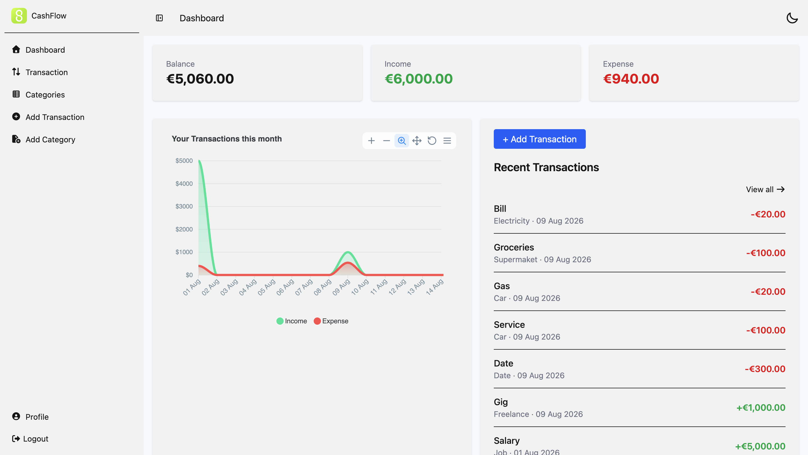
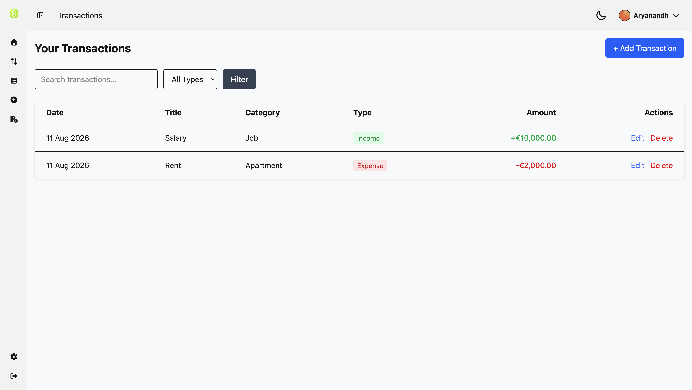
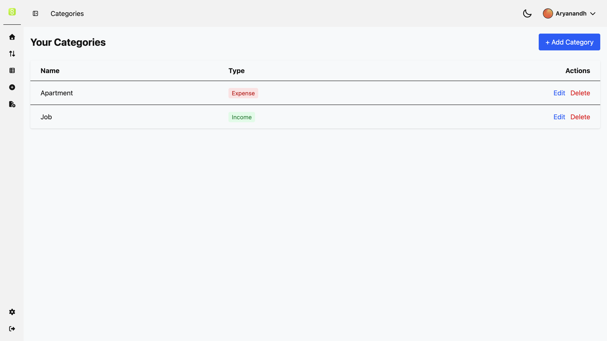

# Cashflow

A simple and clean personal finance tracker built with Laravel.

Track your income and expenses, organize them with categories, and get a clear overview of your finances through a modern dashboard.

## Features

- User Authentication (Register, Login, Logout, Password Reset)
- Dashboard with monthly summary (Balance, Income, Expense)
- Categories (Income & Expense)
- Transactions (Full CRUD)
- Search & Filter transactions
- Profile management (Update name, email & password)
- Responsive design
- Flash messages for better user feedback

## Tech Stack

- **Backend:** Laravel 13
- **Frontend:** Blade + Tailwind CSS + DaisyUI
- **Database:** MySQL (Hosted on Aiven)
- **Authentication:** Manual (with Password Reset)
- **Email:** Resend SMTP

## Screenshots

| Dashboard                         | Transactions                                  | Categories                                |
| --------------------------------- | --------------------------------------------- | ----------------------------------------- |
|  |  |  |

## Project Structure

- app/Models → Category, Transaction, User
- app/Http/Controllers → Dashboard, Category, Transaction, Profile, Auth
- resources/views → Blade templates
- routes/web.php → Application routes

## Live Preview

https://cashflow-personal-finance-tracker.onrender.com/

## Future Improvements

- Receipt image upload
- Monthly/Yearly reports
- Export to CSV
- Multiple wallets/accounts
- Recurring transactions
